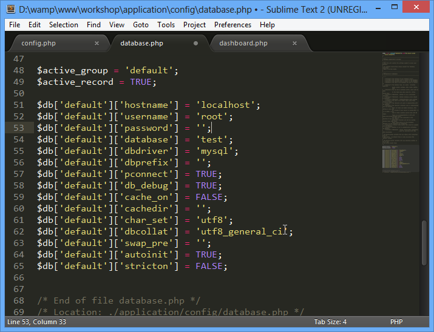

Codeigniter Workshop manual
===========================

This is to help with Codeigniter workshop as conducted by me. 

The What
--------

CodeIgniter is an Application Development Framework - a toolkit - for people who build web sites using PHP. Its goal is to enable you to **develop projects much faster** than you could if you were writing code from scratch, by providing a rich set of libraries for commonly needed tasks, as well as a **simple interface** and **logical structure** to access these libraries. CodeIgniter lets you creatively focus on your project by minimizing the amount of code needed for a given task.

The Why
-------

CodeIgniter is right for you if:

- You want a framework with a **small footprint**.
- You need **exceptional performance**.
- You need **broad compatibility with standard hosting** accounts that run a variety of PHP versions and configurations.
- You want a framework that requires **nearly zero configuration**.
- You want a framework that **does not require you to use the command line**.
- You want a framework that **does not require you to adhere to restrictive coding rules**.
- You do not want to be forced to learn a templating language (although a template parser is optionally available if you desire one).
- You eschew complexity, favoring **simple solutions**.
- You need clear, **thorough documentation**.

Session 0 : Installation and Folder Structure Example
-----------------------------------------------------

This example and workshops were conducted with Windows OS. Internet connection are required (for downloading tools purposes). 

Example are written using text editor Sublime Text 2. Download it [here](http://sublimetext.com) and install it.

*Sublime Text 2 Download Page*

*Sublime Text Example*

Apache, MySQL, PHP and PHPMyAdmin were installed using WAMPP packaged. Download it here and install it. Please make sure to install Microsoft C++ redistributable package before installing WAMPP.

Download Codeigniter [here](http://codeigniter.com/download.php)

Extract (unzip) to home folder (www or htdocs) so it looks like this:

	-www
	  -codeigniter
		-application
		-system
		-user_guide
		-index.php

If you like, change the name codeigniter into CI, so its simple to be called afterwards.

	-www
	  -ci
		-application
		-system
		-user_guide
		-index.php

However, we can change the folder structure to whatever we like. Structure as depicted below are quite widely used for codeigniter:
		
	-www
	  -app_name
		-application
		-index.php
	  -another_app
		-application
		-index.php
	  -ci_system

Just make sure we specify the location of systems file for the application to approriate location. Open the index.php file and change the system path to the new one:

	$system_path = '../ci_system';

This folder structure can cater multiple application within one domain with only one codeigniter core files (system). 

This make the upgrading easier and faster. To use multiple Codeigniter core for multiple application, so that we can fallback gracefully should something happen, we can use folder structure as below:

	-www
	  -app_name
		-application
		-index.php
	  -another_app
		-application
		-index.php
	  -ci_system_v21
	  -ci_system_v22

... and specify which application to use which version of codeigniter in its own index.php.

Test the installation by loading the app via url: http://localhost/app_name

Latest 'test page' design should be like below:

And thus your installation is now complete! For some *nightmare* you can open application folder and wonder what is all the folder and files are doing. 

(Or you can always open the user_guide folder tor the helpful documents.)

> **Exercise 0: Your App**  
Create your codeigniter App with system folder outside of your app_folder. Make sure the test page run fine.

/debug

Session 1: Model - View - Controller
------------------------------------

Codeigniter force the codes into MVC pattern. MVC separate the concerns of codes into 3 distinct function namely:

1. 	**Models**   
	Models are where the heavy processing is done. All the business process, database operation (CRUD) is done here. We always prefer Fat Models over Fat Controller
2.	**Controller**   
	Controller is the one who route the url to specified php class and method. Controller acts like traffic light which control the flow of data to be processed and flow of page to be display as view.
3.	**View**   
	View only manage the front-end aspect of our web app. All the designs/htmls and CSS are manage by view part of MVC.

CodeIgniter has a fairly loose approach to MVC since **Models are not required**. If you don't need the added separation, or find that maintaining models requires more complexity than you want, you **can ignore them** and build your application minimally using Controllers and Views. 

>	CodeIgniter also enables you to incorporate your own existing scripts, or even develop core libraries for the system, enabling you to work in a way that makes the most sense to you.

The simplest flow of information for CodeIgniter app are as followed:

1.	A page is requested via url. Lets say Dashboard page. The url used is http://localhost/app_name/index.php/dashboard
2.	Codeigniter System will translate the uri and run the method **index** in class **Dashboard** form php file named **dashboard.php** inside *app_name/application/controller* folder.

		-www
		  -app_name
			-application
				-controllers
					-dashboard.php
			-index.php
		  -ci_system
	
		[dashboard.php]--------------------------
		class Dashboard extend CI_Controller{	
			function index(){
				echo 'Welcome To Dashboard';
			}
		} 

	here we can see that Codeigniter will run and display 'Welcome To Dashboard'. No Models and Views involved in this example.

More complex example when the data, lets say the string 'Welcome To Dashboard' is processed from models and the send to view files.

For this example we will create two new files at *application/models/m_dashboard.php* and another one at *application/view/v_dashboard.php*:

	-www
	  -app_name
		-application
			-controllers
				-dashboard.php
			-models
				-m_dashboard.php
			-views
				-v_dashboard.php
		-index.php
	  -ci_system

Change the **dashboard.php** into this:

	class Dashboard extend CI_Controller{
		function index(){
			$this->load->model('m_dashboard');
			$str = $this->m_dashboard->index_data();
			
			$data['index'] = $str;
			
			$this->load->view('v_dashboard, $data);
		}
	}

As we can see, the dashboard controller will first load the models that it need by using load method. This load method is inherited from CI_Controller parent. 

All models loaded can then be called via *$this->model_name->model_method()* to initiate the models method process. Here we will run method *index_data()* which will return the string 'Welcome To Dashboard'.

Fill the **m_dashboard.php** file with codes as below:

	class M_dashboard extend CI_Model{
		function index_data(){
			return 'Welcome To Dashboard';
		}
	}

It is really direct. The code will return string 'Welcome To Dashboard' to whoever calling it.

As per example, the one who call it is variable $str in dashboard controller.

The string then loaded into array $data with key 'index' and sent to view via load method second parameter as shown in the example.

	$this->load->view('view_files', $second_parameter);

THe view files then will capture the string into new variable based on the key. So here, the key contain the string within array data is 'index', thus in view files codeigniter will spawn new variable with the name $index containing the string.

Fill in the **v_dashboard.php** files with the codes below:

	<html>
		<head>
			<title>Dashboard</title>
		</head>
	<body>
		<?php
			echo '<h1>'.$index.'</h1>';
		?>
	</body>
	</html>

We can see that v_dashboard.php resembles a lot like plain html files. Keep in mind that view files are like front end template to our application and we will populate it from data sent from controller. Example here is the string 'Welcome To Dashboard' which was sent in variable $index.

> **Exercise 1: Add new page**    
> Add new page which is linked from dashboard to url *http://localhost/app_name/index.php/dashboard/info* . The view page should display php_info() details.

> **Exercise 2: Views List**    
> Add new page which is linked from dashboard to url *http://localhost/app_name/index.php/admin/view_list* . The view page should display all file names within view directory dynamically.

Session 1.1: MVC with string from MySQL DB
------------------------------------------

A lot of data we need usually reside in mysql database. Codeigniter is not limited to only MySQL. In fact CI can connect to multitude of DB engine via its powerful DB connectors wizard.

But MySQL is good enough for example.

Before we start we need to have the connection to MySQL DB.

Open database.php within config directory located at *www/app_name/application/config/database.php*. Change the details to reflect your MySQL connection. As this is local MySQL under WAMP, we can just use the default username and password.

the three important details to be changed are:

	52:		$db['default']['username'] = 'root';
	53:		$db['default']['password'] = '';
	54:		$db['default']['database'] = 'test';

	
After that, we need to create and populate a MySQL database 'test' with appropriate table and data. CI has great tools for Database Management within Database Class. The tools is Database Forge. 

Create new method in *m_dashboard.php* called db_init and type the codes below:

	class M_dashboard extend CI_Model{
		function index_data(){
			return 'Welcome To Dashboard';
		}

		function db_init(){
			$this->load->
		}
	}